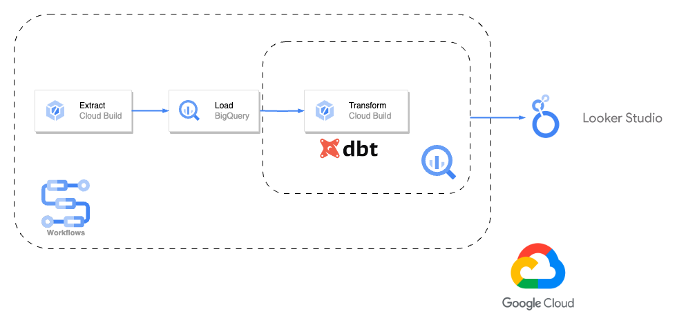
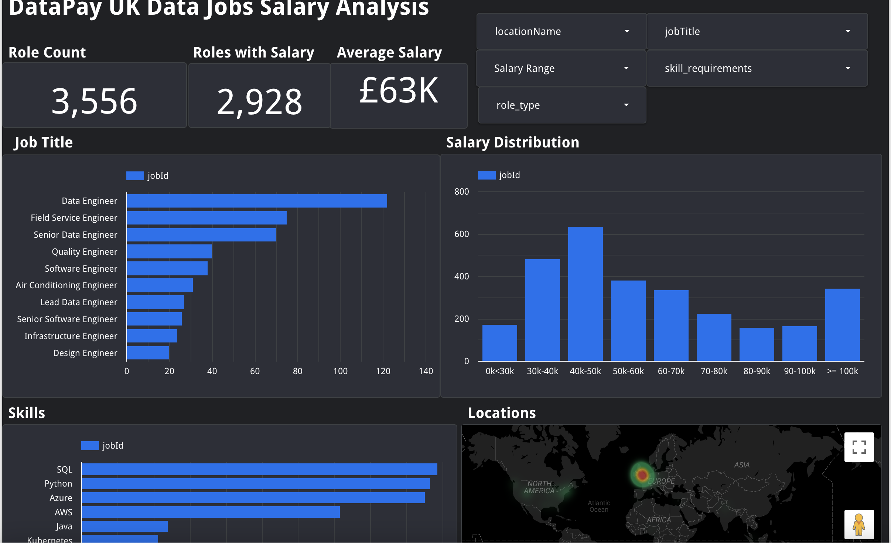

## Datapay

This is an example project setup for ELT pipeline using dbt on Google Cloud Platform. 

The pipeline itself is very simplistic pulling data from a single source (Reed Jobs API) and just performing some simple transformations and keyword extraction with the goal of understanding salaries in the data engineering space. The infrastructure is obviously overkill for the task but can easily be expanded to larger more complex pipelines.

Pipeline runs daily at midnight UTC.

Visualisation: https://lookerstudio.google.com/reporting/8fd12efe-4903-4c4d-ad12-2bd60905471e

### Architecture:



#### Requirements

**Installs for local development:**

* Docker to run airflow: https://docs.docker.com/get-docker/
* Dbt: https://docs.getdbt.com/docs/core/installation
* Terraform: https://developer.hashicorp.com/terraform/tutorials/aws-get-started/install-cli
* Google cloud CLI: https://cloud.google.com/sdk/docs/install 

**Setup:**
 * On Python 3.9+ install ```requirements.txt```
 * Create GCP Project
 * Create GCP Service account with following permissions: 

        - Artifact Registry Administrator
        - BigQuery Admin
        - Cloud Build Service Account
        - Cloud Run Admin
        - IAM Workload Identity Pool Admin
        - Logs Viewer
        - Secret Manager Admin
        - Service Account User
        - Storage Admin
        - Viewer
        - Workflows Admin
* Fill out terraform variables in a file ```terraform.tfvars``` in ```terraform/``` directory 
* Plan and apply the terraform scripts
* Set up gh oidc secrets in github for gcloud CI: https://cloud.google.com/blog/products/identity-security/enabling-keyless-authentication-from-github-actions
* Commit to main to build docker images and workflows or run ```gcloud builds submit``` commands
* Can either run workflows in GCP console, schedule with ```workflows/scheduler.sh``` script or run airflow locally by navigating to ```airflow/``` directory and running ```docker compose up``` and adding the service account json key as the GCP default secret in airflow


### Extract:
Extract is done using docker images stored in Artifact Registry and can be ran as a Cloud Run or Cloud Build job.

The extract process is as follows:

* Pull all listings matching keywords from Reed API

* Pull details for all listings not currently in the target database (this is to save time as Reed API is slow for pulling individual listing details due to request limits)

* Save outputs to GCS


### Load:

* Raw listings and details loaded into ingestion-time partitioned staging tables in bigquery.


### Transform:
Transforms are done in dbt using docker images stored in Artifact Registry and can be ran as a Cloud Run or Cloud Build job. 


### Orchestration

Airflow pipeline or Cloud Workflows runs ELT daily, I have set up the CI with Cloud Workflows as this is a lot more cost effective.

### Infrastructure

Terraform is used to provision environment. Note: You will need an existing project and service account with appropriate permissions.

### CI

Github actions are used to run CI and tests for airflow pipelines

### Visualisation

Dashboard is built in Google Looker Data Studio and can be found at: https://lookerstudio.google.com/reporting/8fd12efe-4903-4c4d-ad12-2bd60905471e

The salary figures, where available, are calculated as an average of the minimum and maximum salary provided by Reed.



**Note on limitations in visualisation:**

Data Studio is a free tool limited in it's functionality. In particular when filtering by skills (a repeated field/multi-valued dimension) you will observe that selecting multiple skills runs **OR** logic in the filtering rather than **AND**. 

For example, selecting skills 'Python' and 'AWS' will display jobs containing 'Python' or 'AWS'. i.e. this may include GCP based roles that use Python. Selecting skill 'Python' and unselecting 'Spark' will display jobs requiring 'Python' even if they also require 'Spark'. 

For skills you don't want displayed I planned adding a 'non skill requirements' filter but this would create more confusion with the **OR** filtering logic. 

I have not found a solution to this problem in Data Studio. As such I would recommend only using the skills filter when interested in averages for more advanced skills (e.g. Spark, Scala, Kafka), and not including the more standard skills (e.g. Python, SQL)

